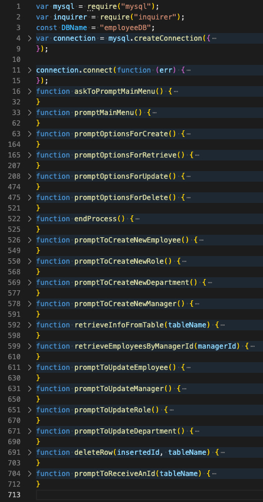

# Employee Tracker Content Management System [](https://opensource.org/licenses/MIT)

## Table Of Contents

1. [License](#license)

2. [Description](#description)

3. [Installation](#installation)

4. [Usage](#usage)

5. [Questions](#questions)

## Description

Employee Tracker is a System which allows business owners to easily interact with employee database of his company.
By interaction it means to create, retrieve, update, or delete any employee, role, manager, or department from the database.

Bellow is app's compiled view of the code:



## Installation

To instal insert in your bash:

```bash
git clone git@github.com:paveldarii/employee-tracker-CMS.git
```

Then, go to the application home directory from your bash and insert there:

```bash
npm i
```

Last thing, you will need to create a database named employeeDB, so after you start mysql in your bash, terminal, or MySqlWorkbench, just insert there all the code from the employee.sql file located in home directory and run it.

Congratulation, you just installed Employee Tracker CMS on your computer!

## Usage

This application is highly intuitive, by the way is organized.
For example, to start the application just insert next code in your bash:

```bash
node server
```

Next, will be prompted a menu which will ask you what action to perform.


Then, you should choose what to perform. Next example is with Retrieve.


After I chose Retrieve All Managers, I received the table I asked for and a question bellow that asks to return to the main menu.


The whole application works in the same intuitive way as the example presented above.

## Questions

My GitHub profile: [https://github.com/paveldarii](https://github.com/paveldarii).

My email address: paveldarii@yahoo.com

## License

[The MIT License](https://opensource.org/licenses/MIT/)
